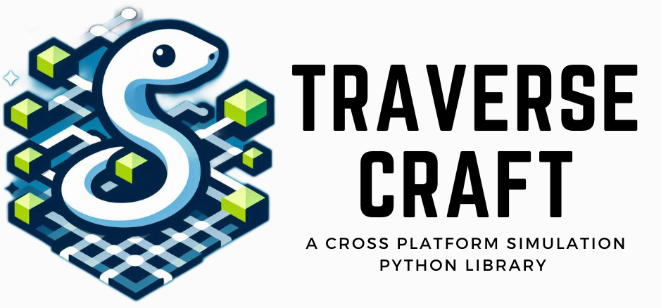

<picture align="center">
  <!-- <source media="(prefers-color-scheme: dark)" srcset="traverseCraft/icons/logo/traverseCraftExtentedLogo.png"> -->
  
</picture>


[](https://www.python.org/)
[](https://python.org "Go to Python homepage")


[](/docs/ "Go to library documentation")
[](https://opensource.org/licenses/MIT)

[](https://github.com/srajan-kiyotaka/Pothole-Mapping-Project)
[](https://github.com/yourusername/your-repo)


<center>
  <h1>
  Traverse Craft
  </h1>
</center>

TraverseCraft is a cross-platform simulation tool written in Python, designed as a library for simulating various algorithms in real time. TraverseCraft allows users to create custom worlds, populate them with agents, and observe how different algorithms operate within these environments. The library leverages the [tkinter](https://docs.python.org/3/library/tkinter.html#module-tkinter) library for fast and responsive simulations. Whether you're a student, educator, or researcher, TraverseCraft provides an intuitive framework to create, visualize, and interact with different world type using their respective agents. 

Please visit the our official [website]() for more information.

## Features

- **Cross-Platform:** TraverseCraft operates seamlessly on various operating systems, ensuring a consistent experience for all users.
- **High Performance**: Built on the [Tkinter](https://docs.python.org/3/library/tkinter.html#module-tkinter) library for fast and responsive simulations.
- **Real-Time Algorithm Simulation:** Test and visualize the workings of your algorithms, such as search algorithms, in real time.
- **Dynamic Summaries and Heatmap:** Automatically generate summaries and heatmap to track agent movements and node visits dynamically.
- **Customizable World Generation:** Create and customize diverse worlds to suit your simulation needs.
- **Educational Utility:** Enhance the learning experience for students by providing a visual aid to understand algorithm workings, aiding both instructors and learners.
- **Research Application:** An invaluable tool for researchers in fields such as reinforcement learning, AI, ML, deep learning, and algorithm design.
- **User-Friendly Interface and Framework Flexibility:** Provides extensive customization options while remaining accessible to beginners.


## World Types

TraverseCraft currently supports the creation and simulation of three distinct world types:

| World Type  | Description                                                                           |
|-------------|---------------------------------------------------------------------------------------|
| Grid World  | A structured grid layout where agents can navigate based on grid coordinates.         |
| Tree World  | A hierarchical tree structure, perfect for visualizing tree traversal algorithms.     |
| Graph World | A versatile graph structure allowing for complex network simulations and algorithm testing. |

Each world type is equipped with specialized agents designed to interact within these environments, enabling comprehensive testing and visualization of algorithms.

## Installation

To install Traverse Craft, simply run:

### Using pip

```bash
pip install traversecraft
```

### Using conda

```bash
conda install -c conda-forge traverse-craft
```

For detailed installation instructions, refer to our installation guide.

## Getting Started

If you are new to Traverse Craft, start with the [tutorial]() available in our online documentation. The documentation includes a [tutorial](), [example gallery](), [API reference](), FAQ, and other useful information.

To build the documentation locally, please refer to [doc/README.md](doc/README.md).

Explore the source code for deeper insights, or reach out to our community for help. For further assistance, visit our online documentation.

## Discussion and Development

Most development discussions take place on GitHub in this repository via the [GitHub issue tracker](https://github.com/srajan-kiyotaka/TraverseCraft/issues).

We also have a [discussion page]() for quick development-related questions, and regular community meetings open to all contributors.

For more detailed information on communication channels, please visit our [contributor community page]().

To set up a development environment using Docker, follow these steps:

1. Clone the repository:

```sh
git clone https://github.com/your-repo-link
cd traverse-craft
```

2. Build the Docker image:

```sh
docker build -t traverse-craft:latest .
```

3. Run the Docker container:

```sh
docker run -it --rm traverse-craft:latest
```

## Contributing to Traverse Craft

We welcome all contributions, including bug reports, bug fixes, documentation improvements, enhancements, and ideas.

Start by reading our [contributing guide]().

If you have discovered a bug or have a feature request, please submit an issue on GitHub. For more detailed contribution instructions, visit our [contribution page]().

## Citing Traverse Craft

If you use Traverse Craft in your research or publications, please cite our library using the following reference in bibtex:

```bibtex
@misc{traversecrafthq2024,
  author = {Srajan Chourasia, Varun},
  title = {Traverse Craft: A Cross-Platform Simulation Tool},
  year = {2024},
  url = {https://github.com/srajan-kiyotaka/TraverseCraft},
  note = {Version 1.0.0},
  publisher = {Traverse Craft Team},
}
```